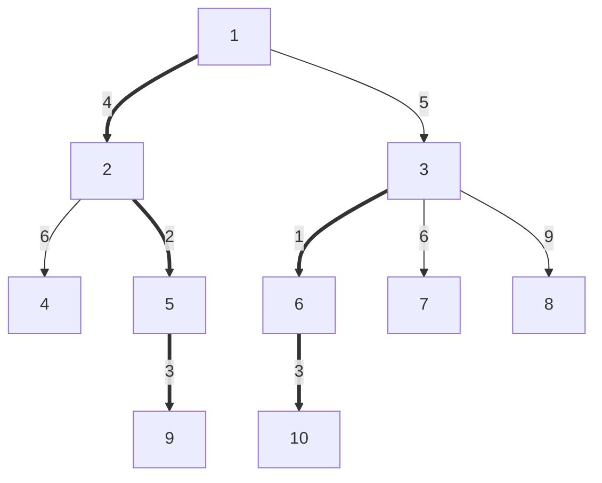

--- 
title: 树链剖分
---

## 定义

将树剖分成一条条不相交的从祖先到子孙的链  

设 `size[x]` 表示 $x$ 点的子树大小  
$size[x] = 1 + \sum\limits_{y\in\{x's\;son\}}size[y]$  

::: tip 

重儿子：一个点的子节点中 $size$ 最大的儿子  
轻儿子：一个点的子节点中 $size$ 不是最大的儿子  
重边：连接 $x$ 和 $x$ 重儿子的边   
轻边：连接 $x$ 和 $x$ 轻儿子的边  
重链：重边连起来形成的链。每个点恰好属于一条重边  

:::
  
  



图中有五条重链：  
$\begin{aligned}
&1\rightarrow3\rightarrow6\rightarrow10\\
&2\rightarrow5\rightarrow9\\
&4\\
&7\\
&8\\  
\end{aligned}$ 

可以发现，每个轻边指向的一个点，都是一条新的重链的开始

## 过程

预处理出 `d[x]` 表示 $x$ 的深度  
预处理出 `f[x]` 表示 $x$ 的父亲  
预处理出 `size[x]` 表示以 $x$ 点为跟的子树大小  
预处理出 `son[x]` 表示 $x$ 的重儿子   
预处理出 `top[x]` 表示 $x$ 所在的重链顶端  
成对记忆：大小{大小、深度}，亲情{父亲、重儿子}，$top$  
  
预处理出可以通过两边 $DFS$ 在 $O(n)$ 时间内完成  
第一遍 $DFS$ 算出 `size[x],d[x],f[x]` ，并找到重儿子 `son[x]`    
第二遍算出 `top[x]` ，$x$ 和 $x$ 的重儿子的 $top$ 相同  

```cpp
//f和d正序就能推出，而size和son都是跟孩子有关，要后序回溯出来
//所以f、d正序用父亲，size、son回溯用儿子
inline void DFS1(int x, int fath){
        size[x] = 1, d[x] = d[fath] + 1; //d[0] = 0, 根节点深度+1
        son[x] = 0, f[x] = fath;         //根节点编号为1，0表示不存在
        for(int i = head[x]; ~i; i = edge[i].nxt){
                int to = edge[i].to;
                if(to == fath) continue;//如果往上走了（链式前向星的问题，无法准确寻找的到底是父亲还是儿子）就不计
                DFS1(to, x);
                size[x] += size[to];
                if(size[son[x]] < size[to]) son[x] = to;
        }
}
```

```cpp
inline void DFS2(int x, int topx){
        top[x] = topx;
        if(son[x] != 0) DFS2(son[x], topx);//最开始的时候访问的序列是以x为top的这条重链
        for(int i = head[x]; ~i; i = edge[i].nxt)
                if(edge[i].to != f[x] && edge[i].to != son[x])//只处理x的轻儿子
                        DFS2(edge[i].to, edge[i].to);//开启一个新重链
}
int main(){ ... DFS1(1, 0); DFS2(1, 1); ... }
```

## 最近公共祖先

### 定义

- 深度：有根树上x到根的距离
- $LCA$：$u$ 和 $b$ 的最近公共祖先 $LCA(u, v)$ 定义为 $u$ 到 $v$ 路径上深度最小的点

任何一条路径都能表示成 $u$ 到 $LCA(u, v)$ 以及 $v$ 到 $LCA(u, v)$ 这两段深度严格递减的链  

### 思路

- 若 $x$ 和 $y$ 在同一条重链，那么 $LCA$ 就是深度较小的那个点
- 否则将 $top$ 的深度较大的那个点往上跳到 $top$ 的父亲，这一步跳过了一条轻边
- 不断重复第二步直到 $x$ 和 $y$ 在同一条重链中
  

```cpp
inline int LCA(int x, int y){
        while(top[x] != top[y]){                        //不在同一条重链
                if(d[top[x]] < d[top[y]]) SWAP(x, y);   //总是让top[x]深度更大（也可也if、else if）
                x = f[top[x]];                          //x往上跳过一条轻边
        }
        //位于同一条重链的情况
        return d[x] < d[y] ? x : y;
}
```
 
所以过程就是：  
提前预处理，并将树剖分成几个链（$DFS1, DFS2$）  
然后获取 $LCA$ 时可以更快，因为每次跳的是一个链（$LCA$）  


## 树上操作

操作有以下四种  
- `1 x y z` 将 $x$ 到 $y$ 路径上每个点点权都加上 $z$ 
- `2 x z  ` &nbsp;&nbsp;&nbsp;&nbsp;将子树内每个点点权都加上 $z$ 
- `3 x y  ` &nbsp;&nbsp;&nbsp;&nbsp;查询 $x$ 到 $y$ 路径上每个点的点权之和
- `4 x    ` &nbsp;&nbsp;&nbsp;&nbsp;&nbsp;&nbsp;&nbsp;&nbsp;查询 $x$ 子树内每个点的点权之和
  
### 思路
树链剖分，在第二次 $DFS$ 中先 $DFS$ 重儿子再 $DFS$ 轻儿子  
将依次 $DFS$ 到的点记录下来，则每条重链是一个连续区间，每个点的子树也是一个连续区间  
对于子树操作，至此转化为了区间操作，可以线段树维护  
对于任意路径操作，要么在同一条重链，要么可以分解为最多 $log$ 条重链+轻边，同样可以转化为区间操作  
子树操作：$O(logn)$  
  
添加成员变量 `dfn[], id[]`  

```cpp
...
inline void DFS2(int x, int topx){
        top[x] = topx;
        dfn[++dfsid] = x;//原始x对应的DFS序新编号是Nid[x];
        id[x] = dfsid;   //新编号Nid[x]对应的老编号是x，即Oid[Nid[x]] = x
        ...
}
...
```

### 路径操作  

切割为一个个重链与轻边从而保证每片 $DFS$ 序连续  
然后对切割后对路径进行操作  

```cpp
inline ll ope_Path ( int x, int y, ll c, bool op ) { // op 0:修改 1:查询
        ll res = 0;
        while ( top[x] != top[y] ) {
                if ( d[top[x]] < d[top[y]] ) swap(x, y);
                if ( !op ) Update ( id[top[x]], id[x], c );
                else       res += Query ( id[top[x]], id[x] );
                x = f[top[x]];
        }
        if ( d[x] > d[y] ) swap(x, y);
        if ( !op ) Update ( id[x], id[y], c );
        else       res += Query ( id[x], id[y] );
        return res;
}
```

### 子树操作

因为子树内一定是连续的 $DFS$ 序，所以起始为 $id[x]$ ，结束于起始序加上子树大小的值 $id[x]+sz[x]-1$  

```cpp
inline ll ope_Son ( int x, ll c, bool op ) { // op 0:修改 1:查询
        ll res = 0;
        if ( !op ) Update ( id[x], id[x] + sz[x] - 1, c );
        else       res += Query ( id[x], id[x] + sz[x] - 1 );
        return res;
}
```