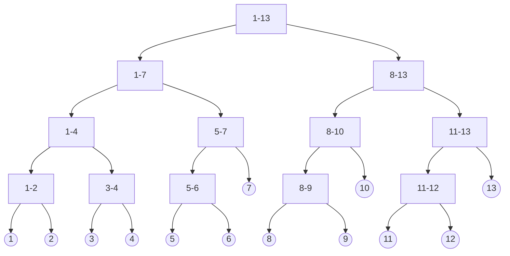

> <font color=#FFA500>回顾题：</font>  
> 张煊的金箍棒是由N段相同长度的金箍棒连接而成（最开始每段金箍棒的价值都是 $1$，从 $1\to N$）  
> 张煊作为金箍棒的主人，可以对金箍棒任意一段施展魔法操作，每次将从 $X$ 到 $Y$ 的一段增加价值 $Z（1、2、3）$  
> 现在，张煊想知道执行 $M$ 次操作后某一段金箍棒总值，有 $Q$ 次查询，每次询问一段（ $A$ 到 $B$ ）金箍棒的价值和  
> 

> 在<font color=#FFA500>线段树</font>的题中，改变题目为每次将从 $X$ 到 $Y$ 的一段<font color=#008B8B>变为</font>价值 $Z（1、2、3）$

## 线段树Segment Tree

### 概念
假设有编号 $1$ 到 $n$ 的 $n$ 个点，每个点都存了一些信息，用 $[L,R]$ 表示下标L到R的区间信息。  
又称区间树IntervalTree，是一棵二叉树，而且是平衡二叉树，但不是完全二叉树（类似而已）</p>  

### 原理
将 $[1,n]$ 分解成若干个特定子区间（数量不超过4*n）  
然后将每个区间 $[L,R]$ 都分解为少量特定子区间，通过对这些少量子区间的修改或者统计，来实现快速对 $[L,R]$ 的修改或统计

### 图示



### 属性
1.每个区间长度为区间内整数个数  
2.叶子节点长度为 $1$ ，不能再分  
3.若一个节点对应区间 $[a,b]$ ，则其子区间对应节点分别是 $[a,(a+b)/2]$ 和 $[(a+b)/2+1,b]$  
4.线段树高度为 $log_2(b-a+1)+1$  
5.线段树把区间上任意一条线段都分成不超过 $2logN$ 条  

### 代码实现

```cpp
//------------------------------------成员
const int maxn 100007//元素总个数
int A[maxn];//原始数组
struct SegTreeNode {
    int val;//节点值，如区间最大值
    int lazy;//懒惰标记，又称延迟更新标记
    //这里还可以根据题目需要增加更多元素
}SegTree[maxn<<2];//定义线段树
//----------------------------------------

inline void PushUp ( int rt ) {//更新节点信息，这里以求和为例
    SegTree[rt].val = SegTree[rt * 2].val + SegTree[rt * 2 + 1].val;
}
inline void build (int l, int r, int rt) { //构造根为rt，A区间为[l,r]线段树
    if (l == r) { // 叶子节点
        SegTree[rt].val = A[l];
        return ;
    }
    int m = (l + r) / 2;
    build(l, m, rt * 2);//递归构造左子树
    build(m + 1, r, rt * 2 + 1);//递归构造右子树
    PushUp(rt);//回溯，向上更新
}
```
### 构造图示

原始数组 $A$
<table>
    <tr>
        <th>值</th> <td>2</td> <td>3</td><td>1</td><td>5</td>
    </tr>
    <tr>
        <th>下标</th> <td>1</td> <td>2</td><td>3</td><td>4</td>
    </tr>
</table>
线段树数组 $S$
<table>
    <tr>
        <th>区间</th> <td>1-4</td> <td>1-2</td><td>3-4</td><td>1-1</td><td>2-2</td><td>3-3</td><td>4-4</td>
    </tr>
    <tr>
        <th>值</th> <td>11</td> <td>5</td><td>6</td><td>2</td><td>3</td><td>1</td><td>5</td>
    </tr>
    <tr>
        <th>下标</th> <td>1</td> <td>2</td><td>3</td><td>4</td><td>5</td><td>6</td><td>7</td>
    </tr>
</table>

## 操作

### 单点更新程序

$A_L+C$

```cpp
//l，r表示当前节点区间，rt表示当前线段树的根节点编号
void Update(int L,int C,int l,int r,int rt) { //L是A下标，C是更新值，[l,r]，rt是线段树数组下标
    if (l == r) {//叶节点，直接修改 
        SegTree[rt].val += C;
        return ;
    }

    int m = (l + r) / 2;
    //判断m在哪个位置，并利用二分思想去修改那条路上的
    if (L <= m) Update(L, C, l, m, rt * 2);
    else     Update(L, C, m + 1, r, rt * 2 + 1);

    PushUp(rt);//回溯，向上更新
}
```
### 单点更新图示

$A_3+2$
原始数组 $A$
<table>
    <tr>
        <th>值</th> <td>2</td> <td>3</td><td>1+5</td><td>5</td>
    </tr>
    <tr>
        <th>下标</th> <td>1</td> <td>2</td><td>3</td><td>4</td>
    </tr>
</table>

线段树数组 $S$ 
<table>
    <tr>
        <th>区间</th> <td>1-4</td> <td>1-2</td><td>3-4</td><td>1-1</td><td>2-2</td><td>3-3</td><td>4-4</td>
    </tr>
    <tr>
        <th>值</th> <td>11+5</td> <td>5</td><td>6+5</td><td>2</td><td>3</td><td>1+5</td><td>5</td>
    </tr>
    <tr>
        <th>下标</th> <td>1</td> <td>2</td><td>3</td><td>4</td><td>5</td><td>6</td><td>7</td>
    </tr>
</table>

### 区间查询

$\sum\limits_{i=L}^RA_i$


```cpp
//[L,R]表示操作区间，[l,r]表示当前区间，rt表示当前节点编号
int Query(int L,int R,int l,int r,int rt) {
    if(L <= l && r <= R) return SegTree[rt].val;//在区间内直接返回
    if(L > r || R < l) return 0;
    
    int m = (l + r) / 2;
    return Query(L, R, l, m, rt * 2)/*左子区间与[L,R]有重叠，递归*/ + Query(L, R, m + 1, r, rt * 2 + 1)/*右子区间与[L,R]有重叠，递归*/;
}
```

## 延迟更新

### 概念
区间更新是指更新某个区间内所有叶子节点的值，因为叶子节点会影响其相应的非父节点，那么回溯需要更新的非叶子节点也会更多，如果一次性更新完，操作的时间复杂度可达 $O(n)$。  
为此引入线段树中的<font color=#008B8B>延迟标记</font>的概念（又称为<font color=#008B8B>懒惰标记</font>），这也是线段树中的精华所在。  

### 延迟标记
每个节点新增一个标记，记录这个节点是否进行了某种修改（这种修改操作会影响其子节点），对于任意区间的修改，我们先按照区间查询的方式将其划分为线段树中的节点，然后修改这些节点的信息，并给这些节点标记上代表这种修改操作的标记。  
在修改和查询时，如果我们到了一个节点 $p$ ，并且决定考虑其子节点，那么我们就要看节点p是否被标记，如果有，就要按照标记修改其子节点的信息，并且给子节点都标上相同标记，同时消掉节点p的标记。  

### 延迟更新意义
懒惰理由：1.多次更新，一次下推；2.无需要不下推  
懒惰原则：可以懒惰但是不能出错（不主动，不拒绝，但负责）  
懒惰过程：向下查询涉及到多少深度的点就拖着这些点的lazy一边累加一边向下走  

### 线段树构造

```cpp
void build(int l, int r, int rt) { //构造根为rt，A区间为[l,r]线段树
    SegTree[rt].lazy = 0;//初始化延时标记为0
    if (l == r) {//叶子节点 
        SegTree[rt].val = A[l];
        return ;
    }
    int m = (l + r) / 2;
    build(l, m, rt * 2);//递归构造左子树
    build(m + 1, r, rt * 2 + 1);//递归构造右子树
    PushUp(rt);//回溯，向上更新
}
```

### 区间更新

$A_{[L,R]}+C$

```cpp
//l，r表示当前节点区间，rt表示当前线段树的根节点编号
void Update(int L, int R, int C, int l, int r, int rt) { //L是A下标，C是更新值，[l,r]，rt是线段树数组下标 
    if (L <= l && r <= R) {//[l,r]区间在我们要修改的区间内，直接修改 
        SegTree[rt].val += C * (r - l + 1);//更新数字和，向上表示准确
        SegTree[rt].lazy += C;//累加还是赋值看需求
        return ;
    }

    int m = (l + r) / 2;
    PushDown(l, r, rt);//下推以后才准确更新子节点
    //判断m在哪个位置，并利用二分思想去修改那条路上的
    if(L <= m) Update(L, R, C, l, m, rt * 2);
    if(R > m)  Update(L, R, C, m + 1, r, rt * 2 + 1);

    PushUp(rt);//回溯，向上更新
}
```
```cpp
//ln,rn分别为左子树和右子树区间大小
void PushDown(int rt,int ln,int rn)
{
    if(SegTree[rt].lazy) {//下推标记 
        int mid = (l + r) >> 1;
        SegTree[rt * 2].lazy += SegTree[rt].lazy;
        SegTree[rt * 2 + 1].lazy += SegTree[rt].lazy;
        SegTree[rt * 2].val += SegTree[rt].lazy * (mid - l + 1);
        SegTree[rt*2+1].val+=SegTree[rt].lazy * (r - mid);

        SegTree[rt].lazy=0;//清除本节点标记
    }
}
```
### 区间查询

$\sum\limits_{i=L}^RA_i$

```cpp
//[L,R]表示操作区间，[l,r]表示当前区间，rt表示当前节点编号
int Query(int L,int R,int l,int r,int rt) {
    if(L <= l && r <= R) return SegTree[rt].val;//在区间内直接返回
    if(L > r || R < l) return 0;
    
    int m = (l + r) >> 1;

    PushDown(rt, m - l + 1, r - m);//下推以后，才能准确查询子节点

    return Query(L, R, l, m, rt * 2)/*左子区间与[L,R]有重叠，递归*/ + Query(L, R, m + 1, r, rt * 2 + 1)/*右子区间与[L,R]有重叠，递归*/;
}
```

## 分裂与合并

### 目的

对于一个区间 $[1,2,3,4,5]$ ，将其分裂为 $[1,2,3,\_,\_]$ 与 $[\_,\_,\_,4,5]$ 之后进行区间操作  
以及将其快速合并为 $[1,2,3,4,5]$ 后还要进行区间操作  

### 节点信息  
 
由于分裂合并后一个点的左右儿子编号会发生变化，所以我们不能再以 `rt << 1` 和 `rt << 1 | 1` 作为左右儿子了，所以需要额外记录一下  

```cpp
struct node {
        int l, r;
        int val;
} t[];
```

而以编号记录的话，我们可以设置编号为 $0$ 的点为空点，这样我们在递归时不需要跑完整棵树  
并且如果要移动整棵子树，只需要移动这棵树的树根即可  

### 合并  

可以将 $y$ 线段树并入 $x$ 内，这样我们将 $x$ 视作一个位置，它用于接收所有 $y$ 的节点 ，`merge (int &x, int y)`  
若 $x$ 或 $y$ 走到空节点了，如果 $x=0$ ，那么意味着我们要将 $y$ 的子树全部扔给 $x$ 。而如果 $y=0$ ，那么不进行任何操作。这样可以直接 $x|=y$  
如果走到的不是空节点，那么把 $y$ 的节点信息合并给 $x$ 后，继续递归左右儿子  
  
```cpp
inline void Merge (int &x, int y) {
        if (!x || !y) {
                x |= y;
        } else {
                t[x].val += t[y].val;
                Merge(t[x].l, t[y].l);
                Merge(t[x].r, t[y].r);
        }
}
```

### 分裂

由于每次分裂出来一整棵线段树太耗费内存，使用动态开点优化  
将要抽走及其子树的节点编号扔给新开的节点，并返回新开的节点编号  
如果该点不需要被抽走，那么看区间分裂的左右端点来决定要往哪边走  
我们可以有一个引用的参数，与一个返回值配套形成两棵线段树  
  
```cpp
inline int Split (int a, int b, int l, int r, int &rt) {
        int n = ++cnt; // 新开节点编号
        if (a <= l && r <= b) { // 整个都在 [a,b] 内
                t[n] = t[rt]; // 抽掉 rt 及其子树
                rt = 0;
        } else {
                int mid = (l + r) >> 1;
                if (a <= mid) t[n].l = Split(a, b, l, mid, t[rt].l);
                if (b > mid) t[n].r = Split(a, b, mid + 1, r, t[rt].r);
                pushUp(n); pushUp(rt);
        }
        return n;
}
```


