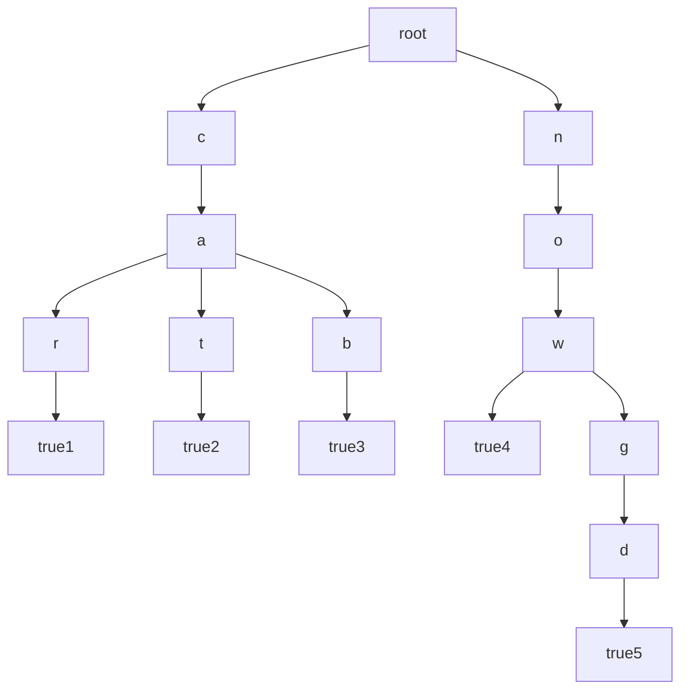

# 📕概述
  
字典树是一种通用于检索某个字符串是否在字符串集合出现过的一种高效数据结构  
多用于目前网页的搜索引擎  
是学AC自动机必储蓄的知识点  

字典树的灵活使用可以不仅限于字符串检索，灵活高效，可以融入较多算法的优化  

# 📕使用

## 😀专用变量

```cpp
const int maxn=1000;//内含字符数   
struct Trie{//字典树结构体
    int to;
    /*

    这里可以加入需要的成员变量

    */
}trie[maxn][/*这里存放字符串内容*/];
int tot_trie;//代表现存的指向型节点
bool end_s[maxn];//判断该字符串是否走完了
```
### 😀构造

我们想插入如下单词集合[car,cat,cab,now,nowgd]，可以构造出如下一棵树


其中从root往下沿着每一条路径走下去都可以成为一个集合内部的单词 

## 流程：

在一个单词中每一个字符进行插入的时候，如果这个字符的指针(to)指向一个存在的节点，那么指针(to)替换为这个节点并进行下一个字符的插入。  
若走到某个字符时指向空节点，就设置这个节点为一个新的指向型节点，然后(to)替换为这个新设置的节点  
  
**函数：**

```cpp
void insert(string s){
    int to=1;
    for(int i=0;i<s.size();i++){
        int cur_c=s[i]-'a';//这个字符分离为一个数放在结构体第二维
        if(trie[to][cur_c]==0) trie[to][cur_c]=++tot_trie;//若为空节点
        to=trie[to][cur_c];//替换
    }
    endd[to]=true;
}
```

## 检索
假设我们要检索某个字符串是否存在于这个字典树中  
与构造很像，我们需要一步一步向下走，一旦走到空节点，就返回了。但还要加一步，如果走到结尾了但是下一个节点的endd值不为true，说明我们检索的字符串只是当前走的字符串的一个前缀，并不等于这个字符串，所以我们依旧返回false  
  
**函数：**

```cpp
bool search(string s){
    int to=1;//检索指针
    for(int i=0;i<s.size();i++){
        to=trie[to][s[i]-'a'];//替换为下一个指针
        if(to==0) return false;//指向空节点
    }
    return endd[to];//判断是否刚好走完
}
```
