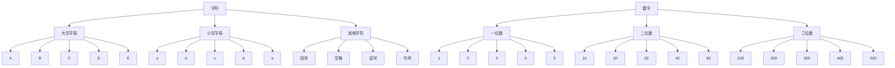
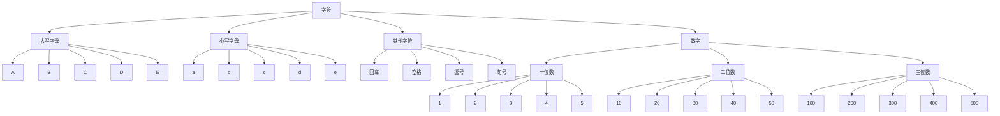

# 概念：
并查集是指在一些有N个元素的集合应用问题中，我们通常是在开始时让每个元素构成一个单元素的集合，然后按一定顺序将属于同一组的元素所在的集合合并，  
其间要反复查找一个元素在哪个集合中。  
这一类问题近几年来反复出现在信息学的国际国内赛题中。  
其特点是看似并不复杂，但数据量极大，若用正常的数据结构来描述的话，往往在空间上过大，计算机无法承受；  
即使在空间上勉强通过，运行的时间复杂度也极高，根本就不可能在比赛规定的运行时间（1～3秒）内计算出试题需要的结果，只能用并查集来描述。    
  
并查集是一种树型的数据结构，  
用于处理一些不相交集合（disjoint sets）的合并及查询问题。  
常常在使用中以森林来表示。----《百度百科》

# 过程：

小故事：



此时我们想要访问200的祖先（数字）  
但200不能直接知道祖先是谁，它要先问他的爸爸（三位数）  
但三位数也不知道祖先是谁，于是三位数去问他的爸爸（数字）  
数字一想，我没有爸爸了，所以数字就是祖先。  
  
在访问中，我们可以看出，数字、一位数、二位数、三位数、1、2、3、4、5、10、20.....的祖先都是数字  
所以它们是一个集。  
同理，字符家族谱中的所有单位也是一个集合。
那么问题来了，两家因为觉得关系太好了想要合并，它们该怎么做呢？  
不妨让数字认另一个字符为爸爸(我们要尽可能利用已知资源来进行合并，否则操作较麻烦，只转认两方祖先可以有效减小树的深度)  
于是成了以下家族谱  


  
这就是并查集的过程内容，那么为了普遍性我们该怎么说呢  
# 操作
我们通常寻找一个人的最高领导者，但每一层都是单独管理，等于说这一层的人不知道上上层的人是谁，所以他要向直系上层询问，再由直系上层向上层询问  
依次循环，知道找出没有上层的人为止，那个人就会是最高领导者  
在归类中我们也可以利用已知函数进行模拟数组为find(x)，而合并中我们也可以只将两个集的最高领导人合并（这里使用认父方式)  
我们在操作时会经常用到两个函数  

## 1.find函数
递归写法：  

```cpp
void find(int x)//查找x的最高领导人
{
    return x == nod[x] ? x : nod[x] = find(nod[x]);
}
```
  
非递归写法  

```cpp
int find(int x)//查找x的最高领导人
{
    while(x!=nod[x])
        x = nod[x];
    return x;
}
```

## 2.merge函数
  
```cpp
void merge(int a,int b)//将a与b合为同集合
{
    if(find(a)!=find(B)) nod[find(B)]=find(a);
}
```
