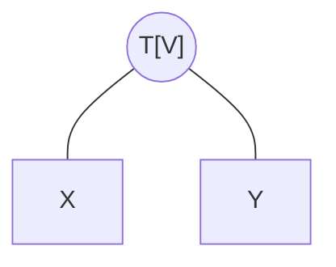

::: tip
**前置知识**
- [kruskal算法](https://tech.chivas-regal.top/blogs/algorithm/graph/kruskal.html)
- [LCA](https://algorithm.therehello.top/graph/lca/)
:::

## 定义

kruskal重构树是在kruskal算法构建最小生成树的基础上，构建出来的一棵新树。  
在这棵树上，我们可以快速得到<mark> $[$ 最小的 $($ 两点之间路径上的最大边 $)$ $]$</mark>  
这棵树的用法我们[下面再说](#作用)  
  
## 流程  

每个点首先看作是一个以自己为根节点的连通块   
  
其余在 kruskal 算法的基础上多了一步  

### 继承

- 对边按边权升序排序
- 遍历边，查看连接的两点是否位于同一连通块
  - 不同连通块 $\rightarrow$ 可以合并<Badge type="tip" text="最小生成树可以建边" vertical="top" />，[插入](#补充)
  - 相同连通块，跳过
- 插入边达到 $n-1$ 条边，退出循环，否则继续第二步

### 补充

对于两个可以合并的节点 $(u,v)$ ，我们断开它们的边 $edge$  
新建一个节点 $T$ ，作为它们各自连通块根结点的共同父亲  
这个新节点的点权即是 $(u,v)$ 路径上的边权 $edge.val$  

::: tip  

即：  


变成了  


:::

## 例子

原图


按边排序完为  

- $1\stackrel{1}{\longleftrightarrow} 3$
- $1\stackrel{2}{\longleftrightarrow} 2$
- $2\stackrel{3}{\longleftrightarrow} 4$
- $3\stackrel{4}{\longleftrightarrow} 4$ 
- $1\stackrel{5}{\longleftrightarrow} 4$ 
- $2\stackrel{6}{\longleftrightarrow} 3$  
  
开始操作  
>我们视新加的点是正方形，权值用 $[]$ 包裹

|枚举边|是否合并|重构树|
|:-:|:-:|:-:|
|$1\stackrel{1}{\longleftrightarrow} 3$|$\checkmark$||
|$1\stackrel{2}{\longleftrightarrow} 2$|$\checkmark$||
|$2\stackrel{3}{\longleftrightarrow} 4$|$\checkmark$||
|`break;`|

## 性质

- 树形为二叉树且是一棵完全二叉树<Badge type="tip" text="性质1" vertical="top" />
- 除了叶子节点之外别的都有点权，且呈一个大根堆<Badge type="tip" text="性质2" vertical="top" />
- 任意两点路径上边权最大值最小时为其 $LCA$ 的点权<Badge type="tip" text="性质3" vertical="top" />

性质 $1$ 平平无奇，但是性质 $2,3$ 就有意思了  
我们来简单说一下原因  
  
按照 $kruskal$ 算法流程，我们枚举的边权会越来越大  
而每个后面枚举到的边权，若是成立，必定是插在 <mark>某个叶子节点</mark> 或者 <mark>之前加过的点</mark> 的上面  
叶子节点无权值这个由定义就可以知道  
而之前加过的点它的点权一定是比当前点权小所以才先枚举  
所以一条链是越来越小的，故成大根堆  
  
考虑性质 $3$  
每一个新加的点权都是最小生成树上的某条边权  
而两个点间接相连是要经过他们在这里的 $LCA$ 的  
又由于越往上权值越大，所以他们的 $LCA$ 就是最大的边权  

## 作用  

我们利用性质 $3$ 能很快得到 <b><mark>两个点路径上最大边权最小时应是多少</mark></b>

## 程序设计

以一道题为例吧 [洛谷P1967_货车运输](https://www.luogu.com.cn/problem/P1967)    
  
我们要走的路上限重要尽可能大，所以构建一棵最大生成树  
在这个最大生成树上建立 $kruskal$ 重构树  

::: details 首先我们建边、求LCA、并查集都要准备好  
<br>  

```cpp
const int N = 1e5 + 10;
namespace Map {
        struct Edge {
                int nxt, to;
        }edge[N << 1];
        int  head[N << 1],  cnt = 0;
        inline void add_Edge ( int from, int to ) {
                edge[ ++ cnt ] = (Edge){ head[from], to };
                head[from] = cnt;
        }
} using namespace Map;

namespace TreeProblem {
        int dep[N];
        int fa[N][25];
        int mx_fa[N];
        inline void DFS ( int x, int fath ) {
                int k;
                for ( k = 0; fa[x][k]; k ++ ) fa[x][k + 1] = fa[fa[x][k]][k];
                mx_fa[x] = k;
                for ( int i = head[x]; i; i = edge[i].nxt ) {
                        int to = edge[i].to;
                        if ( to == fath ) continue;
                        dep[to] = dep[x] + 1;
                        fa[to][0] = x;
                        DFS(to, x);
                }
        }
        inline int LCA ( int x, int y ) {
                if ( dep[x] < dep[y] ) swap(x, y);
                for ( int i = mx_fa[x]; i >= 0; i -- ) if ( dep[fa[x][i]] >= dep[y] ) x = fa[x][i];
                if ( x == y ) return x;
                for ( int i = mx_fa[x]; i >= 0; i -- ) if ( fa[x][i] != fa[y][i] ) x = fa[x][i],
                                                                                   y = fa[y][i];
                return fa[x][0];
        }
} using namespace TreeProblem;

namespace UnionSet {
        int nod[N];
        inline int Find ( int x ) { return x == nod[x] ? x : nod[x] = Find(nod[x]); }
        // 后面这两个手写方便很多
} using namespace UnionSet;
```
:::

然后建立一个点权值  

```cpp
int val[N];
```

打印完边后我们就排个序进行 $kruskal$ 算法即可   
在可以合并的时候进行断边加点操作

```cpp
sort ( nd, nd + m );
int num = 0; // 合并次数
for ( int i = 0; i < m; i ++ ) {
        int fx = Find(nd[i].u);
        int fy = Find(nd[i].v);
        if ( fx != fy ) {
                val[++ num + n] = nd[i].w; // 建立新点并给予点权
                // 两个根节点分别为新点的儿子
                add_Edge(num + n, fx);     
                add_Edge(num + n, fy);
                nod[fx] = nod[fy] = num + n;
        }
}
```

本题中两个点可能并不连通，所以我们 $DFS$ 要从每个不同的根节点去分别跑一次  

```cpp
bool vis[N]; // 记录这个根节点是否跑过了
for ( int i = 1; i <= n; i ++ ) {
        int fi = Find(i);
        if ( !vis[fi] ) 
                DFS(fi, fi),
                vis[fi] = 1;
        }
```

然后就剩一个查询了  

```cpp
cin >> q;
while ( q -- ) {
        int a, b; cin >> a >> b;
        int fa = Find(a), fb = Find(b);
        if ( fa != fb ) {
                cout << "-1" << endl;
        } else {
                cout << val[LCA(a, b)] << endl;
        }
}
```

设计完毕