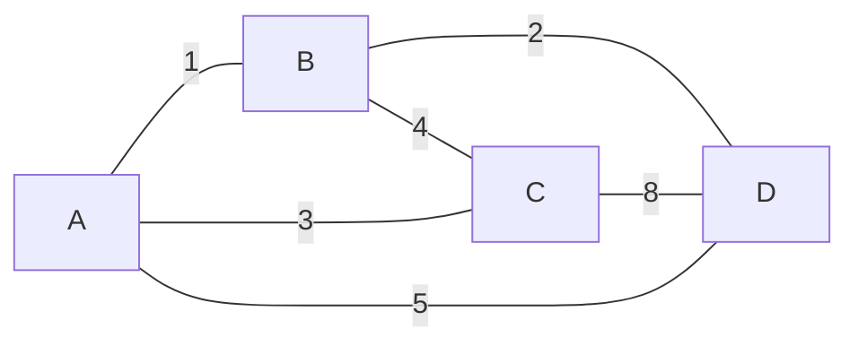
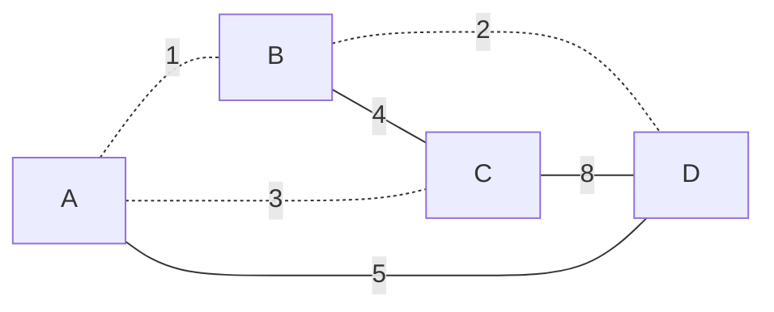
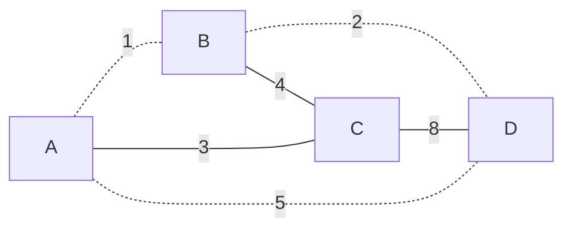
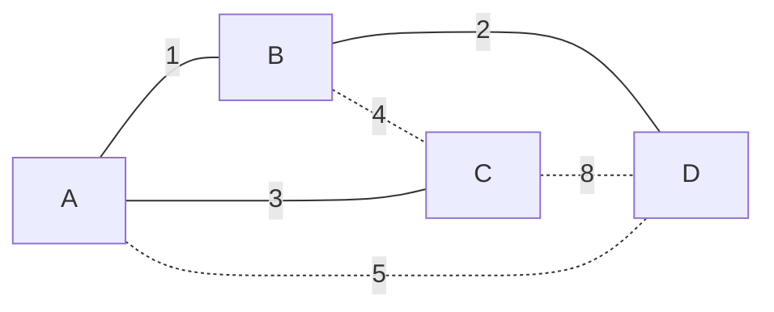

## 概念

生成树：一个有 $n$ 个结点的连通图的生成树是原图的连通子图，且包含原图中的所有 $n$ 个结点。  
最小生成树：一个有 $n$ 个结点的连通图的生成树是原图的极小连通子图，且包含原图中的所有 $n$ 个结点，并且有保持图连通的最少的边。一个连通图至少存在一棵最小生成树包含权最小的一边  

::: tip
前置知识：[并查集](../data-structure/unionset.md)
::: 

## 图解
  
图：  



::: warning  

下面的树中虚线表示不连通，实线表示连通  

:::

生成树 $1$：边权和 $17$  


生成树 $2$：边权和 $15$  


...  
最小生成树：边权和 $6$  



## kruskal算法过程 

一个贪心的思想  
我们每次要捡边权尽可能小的边  
我们对边按边权排序之后  
从小到大遍历这些边
::: warning
如果一个边的两端本身就是在同一个连通块  
那么这条边就没办法插入了
:::
考虑树的性质， $n$ 个节点的树有 $n-1$ 条边  
所以我们插入 $n-1$ 条边之后，就没有办法再插入了，此时就可以直接跳出循环了  

```cpp
namespace UnionSet { // 并查集判连通
    int nod[N];
    inline void Find ( int x ) { ... }
    inline void Merge ( int x, int y ) { ... }
    inline void Check ( int x, int y ) { ... } // 1:连通 0:不连通
}

int n, m;       // 点数，边数
cin >> n >> m;
struct Edge { int u, v, w; } edge[m]; // 边
for ( int i = 0; i < m; i ++ ) cin >> edge[i].u >> edge[i].v >> edge[i].w;

sort ( edge, edge + m, [&]( Edge a, Edge b ) { return a.w < b.w; }) // 按边权排序

int cnt = 0; // 已插入边数
int res = 0; // 最小生成树权值
for ( int i = 0; i < m; i ++ ) {
    if ( !UnionSet::Check(edge[i].u, edge[i].v) ) 
        UnionSet::Merge(edge[i].u, edge[i].v),
        cnt ++,
        res += edge[i].w;
    if ( cnt == n - 1 ) break;
}
if ( cnt < n - 1 ) cout << "无法生成最小生成树" << endl;
else               cout << res << endl;
```

