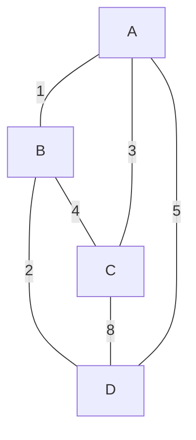
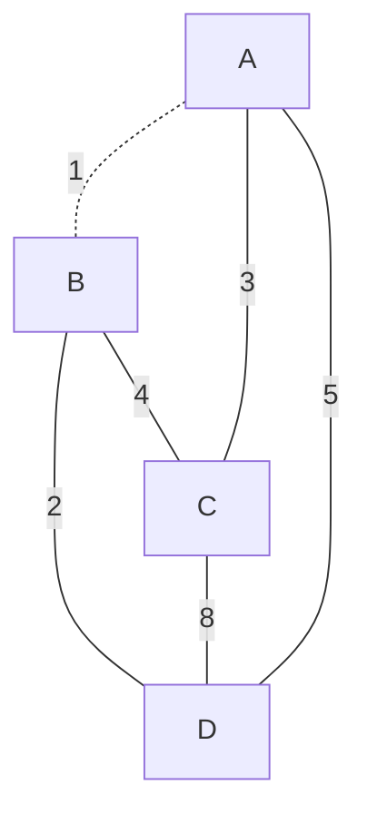
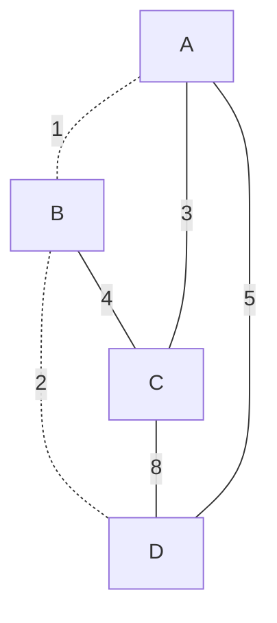
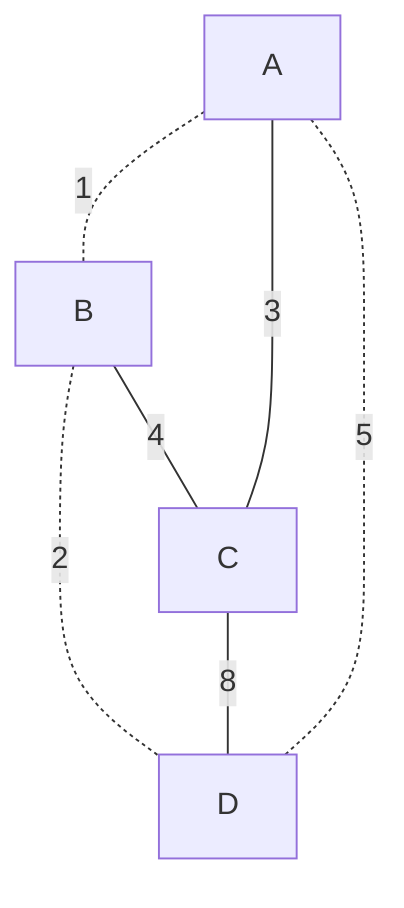
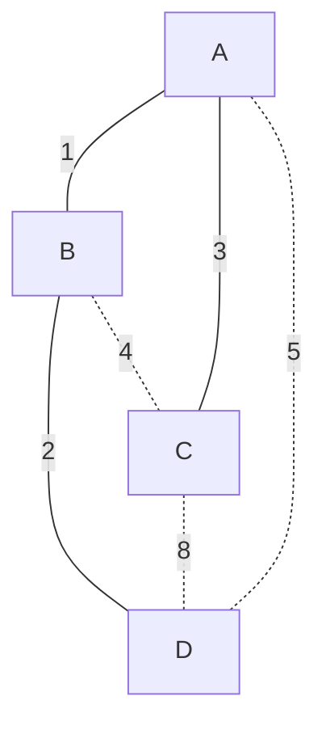

# 概念：

生成树：一个有 n 个结点的连通图的生成树是原图的连通子图，且包含原图中的所有 n 个结点。  
最小生成树：一个有 n 个结点的连通图的生成树是原图的极小连通子图，且包含原图中的所有 n 个结点，并且有保持图连通的最少的边。一个连通图至少存在一棵最小生成树包含权最小的一边  

之所以要放在与并查集一起更新，是因为很多最小生成树题判断回路和其他功能会用到并查集，两者关系挺大的  

# 图解：  
  
完全图：  

*下面的树中虚线表示不连通，实线表示连通*  
生成树1：边权和22  

生成树2：边权和20  

生成树3：边权和15  

最小生成树：边权和6  

## kruskal算法过程：  
用结构体存（点1，点2，边权）  
每次选取最短一边做树枝（但要判断是否构成了回路，有回路就跳过），做n-1个树枝  
判断回路：并查集  
