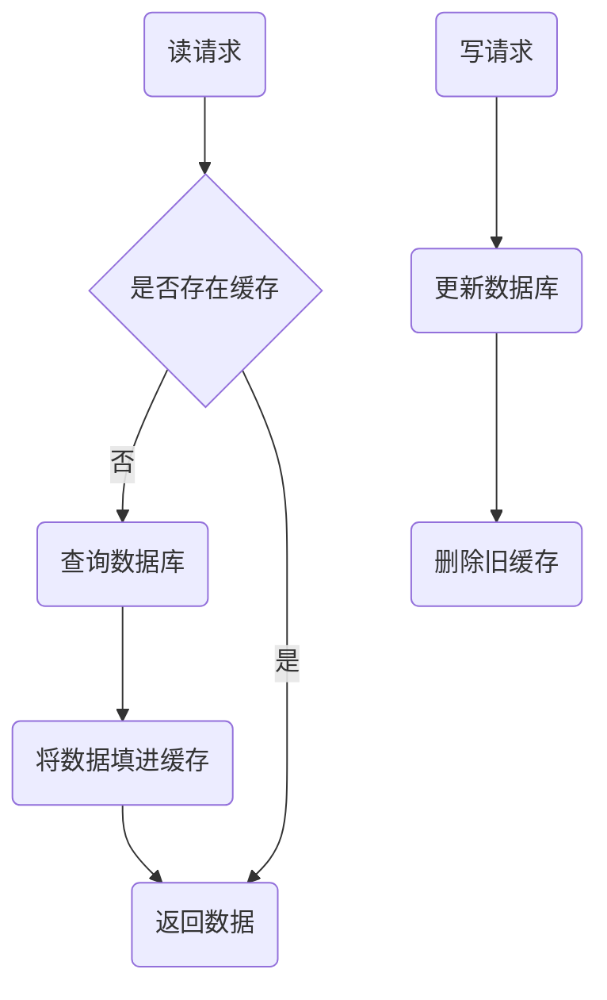
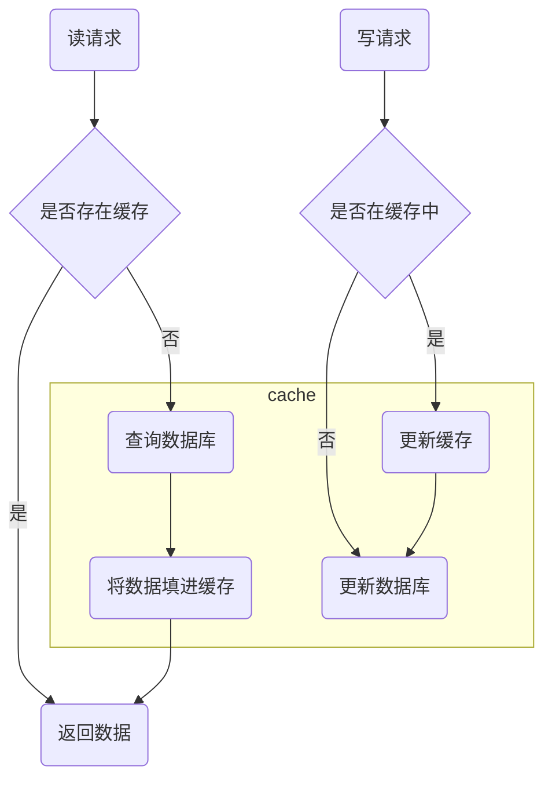

双写时最重要的就是数据的一致性问题，通常**因为网络信道不稳定、服务器不稳定第问题，导致的 Redis 与 MySQL 之间存在数据不一致**。  
  
比如可能想到的 Redis 定时刷新到 MySQL 上这种简单但非常危险的双写策略，此时如果一个请求写完缓存然后数据还没有刷到磁盘上的时候缓存系统崩了，那么就导致实际的数据并不存在于磁盘上。  

为了避免这种问题，我们需要使用合适的读写策略。

## 缓存读写策略

### Cache-Aside Pattern 旁路缓存模式



这种模式是**最常用**的，写的第一步直接通向数据库，强调以数据库信息为准，请求执行效率没有非常高，但是数据是较为稳定的。  

### Read/Write Through Pattern 读写穿透模式



被框选标上 `cache` 的部分，全部是由一个叫 Cache Provider 的工具对客户端提供的服务，并将过程抽象出来了。  
如果单看步骤中的逻辑，这个模式是以缓存优先的，它极大地提高了请求速率，但是很容易出现数据没有持久化的现象。

### Write Behind Pattern 异步缓存写入模式

步骤和 [Read/Write Through Pattern](#readwrite-through-pattern-读写穿透模式) 一样，且提供服务的也是 Cache Provider，但是它在读写中更新完缓存之后直接返回数据，采用异步将数据提交给了数据库。  

## ❓常见问题

由于常用的是 Cache-Aside Pattern ，所以这里就根据此模式的几个问题来进行说明。  

### 写操作最后为什么不能是更新缓存而是删除？   

::: tip

举个例子，小猪在外地，召集大家给自己装修房子，两个施工队踊跃报名

- 每次都是更新  
先来了个施工队1说要装修成绿色的房子，小猪同意了。   
又来了个施工队2说要装成红色的，小猪想想红色确实比绿色好，于是同意了。  
施工队2非常积极，刚说完就给它装成红色的了。  
施工队1路上堵了一下车，来了之后给它装成绿色的了。  
小猪回来看到绿色的房子，枯了😭。
- 每次都是删除  
上面施工队报名的顺序、施工队来装修的顺序都一样。  
但施工队每次装修完都给它换成原样。  
小猪回来看到自己的房子没有变化，虽然苦恼但还是自己动手装修成自己想要的样子了，笑了😄。

:::

如果是更新缓存，因为网络延迟极易出现**后进行的写请求被之前的写请求覆盖更新的情况**。 

两个写操作：
- 写请求A：写入 `name` 为 `snopzyz`
- 写请求B：写入 `name` 为 `snopzyz`

<table>
  <tr>
    <th>操作序号</th>
    <th>写请求A</th>
    <th>写请求B</th>
    <th>缓存</th>
    <th>数据库</th>
  <tr>
  <tr>
    <td>1</td>
    <td>更新数据库 name=snopzyz</td>
    <td></td>
    <td><code>(nil)</code></td>
    <td><code>snopzyz</code></td>
  </tr>
  <tr>
    <td>2</td>
    <td></td>
    <td>更新数据库 name=demo</td>
    <td><code>(nil)</code></td>
    <td><code>demo</code></td>
  </tr>
  <tr>
    <td>3</td>
    <td></td>
    <td>更新缓存 name=demo</td>
    <td><code>demo</code></td>
    <td><code>demo</code></td>
  </tr>
  <tr>
    <td>4</td>
    <td>更新缓存 name=snopzyz</td>
    <td></td>
    <td><code>snopzyz</code></td>
    <td><code>demo</code></td>
  </tr>
</table>

最后缓存和数据库中的数据发生了不一致的状态，如果是删除最后两者分别为 `(nil)` 和 `null` ，就没有不一致之说了。  
但是**通过删除来解决数据不一致问题的方式会使得读时缓存命中率极低**，尤其是读写量都很大的时候，解决方案：  
- 数据一致性要求低：可以将删除变成更新并给定一个非常短的超时时间<br>这样大量对这个数据的写中不一致时间的占比还是很短的
- 数据一致性要求高：加入锁/分布式锁，将写操作原子化

### 写操作为什么要先更新数据库再删缓存？  

第一步就指向数据库，极大地保证了数据的持久性以及读写发生时数据的稳定性。  

::: tip
举个例子，小猪在装修自己的房子
- 先把外表翻新刷完漆非常好看，到后面再装修内饰<br/>邻居们看见了都忍不住去它家里做客，发现家里还和以前一样破<br/>大家都觉得小猪是一个外光里毛糙的动物，小猪被冠上了不好的名声😭
- 先把内饰装好，到后面再给外表翻新刷漆<br/>装内饰的时候大家都不知道，路上走过的动物邻居看着外面觉得小猪和之前是一样的<br/>小猪装完内饰了去把外表刷完，邻居们看了也忍不住去家里做客<br/>邻居们发现小猪的家非常好看，都给小猪了大大的好评😄
:::

如果写操作先删缓存，**读写同时发生时，读操作很容易在“刚删完缓存写操作还没有操作数据库之前”将缓存恢复**。  

两个请求：
- 写请求：修改 `name` 从 `snopzyz` 变成 `demo`
- 读请求：读取 `name`

<table>
  <tr>
    <th>操作序号</th>
    <th>写请求</th>
    <th>读请求</th>
    <th>缓存</th>
    <th>数据库</th>
  <tr>
  <tr>
    <td>1</td>
    <td>删除缓存</td>
    <td></td>
    <td><code>(nil)</code></td>
    <td><code>snopzyz</code></td>
  </tr>
  <tr>
    <td>2</td>
    <td></td>
    <td>缓存中没有，读取数据库</td>
    <td><code>(nil)</code></td>
    <td><code>snopzyz</code></td>
  </tr>
  <tr>
    <td>3</td>
    <td></td>
    <td>填入缓存 name=snopzyz</td>
    <td><code>snopzyz</code></td>
    <td><code>snopzyz</code></td>
  </tr>
  <tr>
    <td>4</td>
    <td>修改数据库 name=demo</td>
    <td></td>
    <td><code>snopzyz</code></td>
    <td><code>demo</code></td>
  </tr>
</table>

最后又不一致了

### 此模式能完全保证数据一致性吗？  

并不能虽然概率很小，和上面的一个道理，若依旧是**一读一写，读的时候缓存刚好失效（等同于删除缓存），读完旧数据又是在写操作全部执行完了才填入缓存，仍然会数据不一致**。  
解决办法下面独立立出一个标题：[延时双删](#延时双删)

## ✅常见解决

### 延时双删

为了应对 [此问题](#此模式能完全保证数据一致性吗) 专门作出的方案
1. 删除缓存
2. 更新数据库
3. 睡眠一段时间再次删除缓存

为了防止写操作被一个读操作的两步完全包裹，**写操作在两步执行完后睡眠一段时间，再次删除可能被读操作填入的缓存**  

```java
@Service
public class UserService {

    @Autowired
    private RedisTemplate<String, Object> redisTemplate;

    /**
     * 更新 user:<user.id>
     * @param user 新的 user
     */
    public void update (User user) {
        // 1. 删除缓存
        System.out.println("删除缓存中的 user:" + user.getId());

        // 2. 更新 db（这里简单输出一下）
        User oldUser = new User(1, "snopzyz", 21); // 假设为之前数据库中的 user
        System.out.println("更新 db 中 user:" + user.getId() + "\n\t旧数据：" + oldUser + "\n\t新数据：" + user);

        // 3. 再次删除缓存
        new Thread(() -> {
            // 先睡眠
            try {
                Thread.sleep(1000L);
            } catch (InterruptedException e) {
                e.printStackTrace();
            }
            // 再删除
            redisTemplate.delete("user:" + user.getId());
        });
    }

}
```